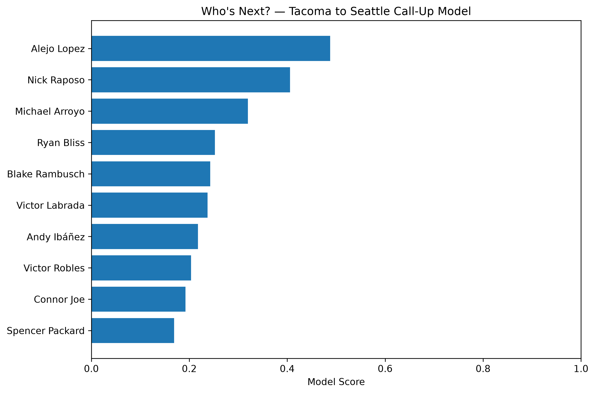

# Rainier to Mariner

## Who's Next?

Can minor league performance help predict which Tacoma Rainiers player is next to receive a Seattle Mariners call-up?

This project explores that question using MLB Stats API data, historical Tacoma-to-Seattle transactions, and machine learning.

The project started with a broader question:

> **Can a player's Triple-A performance be used to predict whether they will reach MLB in the following season?**

After building and evaluating that model, I narrowed the problem to something more directly relevant to baseball operations:

> **Can Triple-A performance help predict which Tacoma Rainiers player is next to receive a Seattle Mariners call-up?**

The final model uses historical Tacoma performance and Mariners transaction data to rank current Rainiers hitters based on patterns associated with previous call-ups.

---

## 2026 Results

The final model was trained on **2021–2025** and evaluated on **2026 as a completely held-out future season**.

| Model | 2026 ROC-AUC |
|---|---:|
| **Random Forest** | **0.701** |
| Logistic Regression | 0.660 |

The Random Forest performed best and was used to generate the final 2026 rankings.

The model is best interpreted as a **ranking system**, not a calibrated probability model.

### 2026 "Who's Next?" Ranking

| Rank | Player | Model Score |
|---:|---|---:|
| 1 | Alejo Lopez | 0.488 |
| 2 | Nick Raposo | 0.406 |
| 3 | **Michael Arroyo** | **0.319** |
| 4 | Ryan Bliss | 0.252 |
| 5 | Blake Rambusch | 0.243 |
| 6 | Victor Labrada | 0.237 |
| 7 | Andy Ibáñez | 0.218 |
| 8 | Victor Robles | 0.204 |
| 9 | Connor Joe | 0.192 |
| 10 | Spencer Packard | 0.169 |



---

## Real-World Validation

One of the most interesting parts of the project was seeing how the model's rankings compared with actual player movement.

Across the different iterations of the project, the models surfaced several players who subsequently reached Seattle.

### Colt Emerson

The original MLB-arrival model ranked **Colt Emerson #2**, with a model output of **85.1%**, based on his 2026 Triple-A performance.

Emerson was subsequently promoted to Seattle on **May 17, 2026**.

### Lazaro Montes

The original MLB-arrival model ranked **Lazaro Montes #1**, with a model output of **89.5%**.

Montes was subsequently promoted to Seattle on **September 1, 2026**.

### Michael Arroyo

The final Tacoma-to-Seattle call-up model ranked **Michael Arroyo #3 among eligible Tacoma hitters** immediately before his promotion.

Arroyo was promoted to Seattle on **September 6, 2026**.

These examples do **not** prove that the model can consistently predict front-office decisions. Call-ups depend on many factors that are not captured by player statistics alone.

However, they provide useful real-world evidence that the statistical signals identified by the models can align with actual player movement.

---

# Project Overview

## Why I Built This

Minor league baseball creates an interesting prediction problem.

Organizations have to continually evaluate players who are developing at different levels, while also considering:

- Current performance
- Age and development stage
- Roster availability
- Positional needs
- Injuries
- Major League performance
- Organizational depth
- Player development plans

Publicly available data cannot capture all of these decisions.

However, it can provide information about one important component:

> **What does a player's current performance profile look like compared with players who have previously reached the Major Leagues?**

I wanted to see how far publicly available statistics could take that question.

---

# Part 1: Predicting MLB Arrival

## The Original Question

The first version of the project asked:

> **Can a player's Triple-A performance predict whether they will reach MLB in the following season?**

To answer this, I collected Triple-A hitting statistics across Minor League Baseball and created a supervised learning dataset.

### Training Seasons

The model used:

- 2021 Triple-A → 2022 MLB
- 2022 Triple-A → 2023 MLB
- 2023 Triple-A → 2024 MLB
- 2024 Triple-A → 2025 MLB

The 2025 Triple-A season was not used for supervised training because the following-season MLB target was not yet complete when the original dataset was created.

---

## Building the Target

Each Triple-A player-season was assigned a binary target:

```text
mlb_next_season = 1
```

if the player recorded MLB hitting statistics in the following season.

Otherwise:

```text
mlb_next_season = 0
```

This produced a dataset of **4,336 player-seasons**:

- 1,642 reached MLB the following season
- 2,694 did not

This created a clear supervised learning problem:

> Given what we know about a player during their Triple-A season, can we estimate whether they will appear in MLB the following year?

---

# Feature Engineering

The baseline model used the following features:

- Age
- Plate appearances
- Batting average
- On-base percentage
- Slugging percentage
- Home runs
- Walk rate
- Strikeout rate
- Stolen bases
- BABIP

Walk and strikeout rates were calculated from the underlying counting statistics:

```text
BB rate = BB / PA
K rate = SO / PA
```

Players with fewer than **100 plate appearances** were excluded to reduce the influence of extremely small samples.

The resulting modeling dataset contained **2,164 player-seasons**.

---

# Baseline Modeling

I compared two classification algorithms:

- Logistic Regression
- Random Forest

The Logistic Regression model used standardized features and a stratified 80/20 train-test split.

### Logistic Regression

| Metric | Score |
|---|---:|
| Accuracy | 0.737 |
| Precision | 0.716 |
| Recall | 0.702 |
| ROC-AUC | **0.797** |

### Random Forest

| Metric | Score |
|---|---:|
| Accuracy | 0.707 |
| Precision | 0.682 |
| Recall | 0.672 |
| ROC-AUC | 0.773 |

The Logistic Regression model performed better on the baseline problem.

---

# What Did the Model Learn?

The Logistic Regression coefficients provided a way to examine which variables were most strongly associated with MLB arrival.

The final coefficients were:

| Feature | Coefficient |
|---|---:|
| Age | -0.737 |
| Batting Average | +0.518 |
| Slugging Percentage | +0.442 |
| BABIP | -0.323 |
| Plate Appearances | -0.302 |
| Stolen Bases | +0.302 |
| Home Runs | +0.233 |
| Walk Rate | +0.232 |
| On-Base Percentage | +0.181 |
| Strikeout Rate | -0.061 |

### Age

Age was the strongest signal in the model.

The negative coefficient indicates that, all else equal, younger players tended to have higher predicted probabilities of reaching MLB.

This makes intuitive sense in a player-development context: a 21-year-old performing well in Triple-A represents a different developmental profile from a 30-year-old performing at the same statistical level.

### Offensive Production

Batting average and slugging percentage were among the strongest positive signals.

Players with stronger offensive production in Triple-A tended to receive higher MLB-arrival predictions.

### Speed and Power

Stolen bases and home runs also contributed positively.

This suggests that the model was capturing more than simply batting average and playing time.

### Important Caveat

These coefficients should be interpreted as **model associations**, not causal relationships.

Baseball statistics are highly correlated with one another. For example, OBP, AVG, SLG, BB rate, and BABIP are not independent measurements.

The model therefore should not be interpreted as saying that changing one statistic by itself would cause a player to become more likely to reach MLB.

---

# Adding Player Development

After establishing the baseline model, I tested whether **year-over-year improvement** could provide additional predictive information.

The idea was that a player's current performance may not tell the entire story.

For example:

> Is a player with a .750 OPS after improving substantially from the previous season more interesting than a player with the same OPS who has remained flat?

To test this, I added changes in:

- OPS
- OBP
- SLG
- Walk rate
- Strikeout rate

For each player with multiple Triple-A seasons, the previous season's statistics were joined to the current season.

I then calculated changes such as:

```text
OPS change = current OPS - previous OPS
OBP change = current OBP - previous OBP
SLG change = current SLG - previous SLG
```

---

# Chronological Validation

The development model was evaluated using chronological splits rather than relying only on random train/test splits.

### 2023 Holdout

Training:

- 2021
- 2022

Testing:

- 2023

Results:

| Metric | Baseline | Development |
|---|---:|---:|
| Accuracy | 0.715 | **0.730** |
| Precision | 0.661 | 0.672 |
| Recall | **0.759** | 0.723 |
| ROC-AUC | 0.788 | **0.796** |

The development features slightly improved ROC-AUC in 2023.

### 2024 Holdout

Training:

- 2021
- 2022
- 2023

Testing:

- 2024

Results:

| Metric | Baseline | Development |
|---|---:|---:|
| Accuracy | **0.719** | 0.701 |
| Precision | **0.770** | 0.747 |
| Recall | **0.621** | 0.576 |
| ROC-AUC | **0.772** | 0.764 |

The development model performed worse in 2024.

### Takeaway

The year-over-year development features did not consistently improve the model.

That was an important result.

Instead of adding complexity simply because more features seemed theoretically useful, I kept the simpler feature set.

---

# Part 2: Changing the Question

## From "Who Reaches MLB?" to "Who's Next?"

The original model answered:

> **Will this player reach MLB next season?**

But that isn't exactly the same problem as:

> **Who is the Mariners' next call-up?**

A player can be highly likely to reach MLB while still not being the next Tacoma player promoted to Seattle.

Call-up decisions are also influenced by:

- Major League roster availability
- Injuries
- Position needs
- Organizational depth
- Player options
- Development plans
- Other players being ahead on the depth chart

That led to the second iteration of the project:

> **Can historical Tacoma-to-Seattle transactions be used to predict which Rainiers hitter is next to be called up?**

---

# Building the Call-Up Dataset

I collected Mariners transaction data from 2021 through 2026 and identified transactions involving players moving:

```text
Tacoma Rainiers → Seattle Mariners
```

The historical transaction data contained hundreds of Tacoma-to-Seattle call-up events.

Because a player can be promoted multiple times, I treated transactions as events rather than assuming every transaction represented a unique player.

---

# Creating Weekly Player Snapshots

Rather than simply asking whether a player was ever called up during a season, I created weekly snapshots of Tacoma performance.

For each snapshot, the model had access to the player's cumulative performance up to that point in the season.

The target was:

```text
called_up = 1
```

if the player was promoted to Seattle during the following week.

Otherwise:

```text
called_up = 0
```

The dataset contained **4,281 weekly player observations**.

Only hitters with at least **25 plate appearances** were included.

Pitchers were excluded based on player-position descriptions.

---

# Class Imbalance

The call-up problem is substantially more difficult than the original MLB-arrival problem because call-ups are relatively rare.

The final call-up dataset contained:

- 4,171 observations without a call-up
- 110 observations followed by a call-up

That means only about **2.6%** of observations were positive.

This makes accuracy a poor primary metric.

A model that predicted "no call-up" for almost everyone could achieve very high accuracy while being essentially useless for finding actual call-up candidates.

Because of this, I focused on:

- ROC-AUC
- Precision
- Recall
- Precision@K

---

# First Call-Up Model

The first call-up model was trained using 2021–2023 data and evaluated on 2024.

The results were:

### Logistic Regression

- Accuracy: 0.708
- Precision: 0.063
- Recall: 0.500
- ROC-AUC: 0.583

### Random Forest

- Accuracy: 0.889
- Precision: 0.056
- Recall: 0.125
- ROC-AUC: 0.581

The Random Forest's high accuracy was misleading.

It identified very few actual call-ups, and both models had ROC-AUC values only slightly above random ranking performance.

This showed that the first version of the call-up problem was not strong enough.

Rather than presenting the model as successful, I used the result to rethink the evaluation.

---

# Why 2026 Became the Holdout

For the final model, I wanted the evaluation to represent the real-world use case as closely as possible.

Instead of randomly splitting the data, I trained exclusively on previous seasons:

```text
Training: 2021–2025
Testing: 2026
```

This means the model never saw 2026 call-up outcomes during training.

The model therefore had to rank players in a season that occurred **after the entire training period**.

This is much closer to how the model would actually be used:

> Train on what happened in the past → rank players in the current season.

---

# Final Call-Up Model

The final dataset contained:

- **3,591 training observations**
- **690 2026 observations**
- **91 training call-ups**
- **19 2026 call-ups**

I again compared Logistic Regression and Random Forest.

### Logistic Regression

**2026 ROC-AUC: 0.660**

### Random Forest

**2026 ROC-AUC: 0.701**

The Random Forest performed better and was selected for the final ranking.

---

# Ranking Performance

Because the practical goal is to identify a small group of potential call-up candidates, I evaluated how often actual call-ups appeared near the top of the model's rankings.

| Top K | Logistic Regression | Random Forest |
|---|---:|---:|
| Top 5 | 0.200 | **0.200** |
| Top 10 | **0.100** | 0.100 |
| Top 20 | **0.100** | 0.050 |

The results reinforce that this model should be viewed as a **ranking tool** rather than a definitive classifier.

A baseball operations team would not necessarily use the model to make a binary "call up / don't call up" decision.

Instead, the more realistic application would be:

> **Which players should receive additional attention?**

---

# The 2026 "Who's Next?" Model

The final Random Forest was applied to eligible Tacoma hitters using their latest available 2026 performance.

The model produced the following top rankings:

| Rank | Player | Model Score |
|---:|---|---:|
| 1 | Alejo Lopez | 0.488 |
| 2 | Nick Raposo | 0.406 |
| 3 | **Michael Arroyo** | **0.319** |
| 4 | Ryan Bliss | 0.252 |
| 5 | Blake Rambusch | 0.243 |
| 6 | Victor Labrada | 0.237 |
| 7 | Andy Ibáñez | 0.218 |
| 8 | Victor Robles | 0.204 |
| 9 | Connor Joe | 0.192 |
| 10 | Spencer Packard | 0.169 |

The model score represents the Random Forest's ranking output.

It should **not** be interpreted as a calibrated probability that the player will be called up.

---

# Michael Arroyo: A Real-World Test

The most interesting result from the final model was **Michael Arroyo**.

Immediately before his September 6, 2026 promotion to Seattle, Arroyo ranked:

> **#3 among eligible Tacoma hitters**

with a model score of approximately **0.319**.

He was subsequently promoted to Seattle.

This is exactly the type of outcome the project was designed to investigate.

However, it is important not to overstate the result.

One successful prediction—or even several—does not establish that the model will consistently predict future call-ups.

Instead, it provides evidence that the model is identifying **some meaningful signals associated with actual player movement**.

---

# What the Project Actually Demonstrated

The most important result of the project is not simply the final ROC-AUC.

The project demonstrated an end-to-end process for taking a baseball question and turning it into a machine learning problem.

### 1. Define the baseball question

The initial question focused on MLB arrival.

### 2. Build the dataset

Historical Triple-A performance was connected to future MLB outcomes.

### 3. Establish a baseline

Simple performance features were tested before adding complexity.

### 4. Test an additional hypothesis

Year-over-year player development features were evaluated.

### 5. Evaluate honestly

The development features did not consistently improve performance.

### 6. Refine the target

The problem was changed from general MLB arrival to the more specific Tacoma-to-Seattle call-up question.

### 7. Build a new dataset

Historical Mariners transactions were used to create call-up labels.

### 8. Address class imbalance

Accuracy was deprioritized in favor of ROC-AUC and ranking metrics.

### 9. Use chronological validation

2026 was held out as a future season rather than randomly mixing future observations into training.

### 10. Apply the model to a real baseball situation

The final model generated a ranked list of current Tacoma players.

That process is ultimately what makes the project useful as a baseball analytics portfolio project.

---

# Limitations

This project is a **proof of concept**, not a production player evaluation system.

## 1. Call-ups depend on more than performance

A player's statistical performance is only one component of a Major League roster decision.

The model does not fully capture:

- Roster construction
- Injuries
- Positional needs
- Defensive ability
- Organizational depth
- Service-time considerations
- Coaching evaluations
- Scouting information
- Internal development plans

## 2. The dataset is relatively small

Only a small number of Tacoma players are called up during a given season, which makes the positive class difficult to model.

## 3. Class imbalance

The call-up target is heavily imbalanced.

This makes traditional accuracy metrics misleading.

## 4. Weekly snapshots are an approximation

The dataset uses weekly performance snapshots rather than a perfect representation of a player's exact roster status at every moment.

## 5. Model scores are not calibrated probabilities

The final Random Forest score is useful for ranking players, but a score such as 0.319 should not be interpreted as "31.9% chance of being called up."

## 6. Only one future season is used for final validation

The 2026 holdout is a useful chronological test, but one season is not enough to establish long-term predictive performance.

Additional future seasons would provide stronger evidence.

## 7. Real-world validation is limited

Colt Emerson, Lazaro Montes, and Michael Arroyo provide interesting examples of the models surfacing players who subsequently reached Seattle.

However, these examples are not sufficient to establish general predictive accuracy.

---

# Future Improvements

There are several ways this project could be developed further.

### Player Context

Add:

- Position
- Defensive value
- Primary position vs. organizational need
- Prospect ranking
- Player age relative to league average

### Major League Context

Add:

- Current Mariners roster
- Open roster spots
- Injured players
- Positional depth
- Recent player performance in Seattle

### Player Development

Add:

- Rolling performance windows
- Month-over-month changes
- Plate discipline trends
- Strike-zone metrics
- Statcast data
- Exit velocity
- Hard-hit rate
- Barrel rate

### Modeling

Test:

- Gradient boosting
- XGBoost
- LightGBM
- Calibrated probabilities
- Survival/time-to-call-up models
- More robust cross-season validation

### Evaluation

As additional seasons become available, evaluate whether the model continues to rank actual call-ups near the top.

The strongest future test would be to train on several historical seasons and repeatedly hold out each subsequent season.

---

# Project Structure

```text
RainierToMarinerPredictiveModel/
├── data/
│   ├── players.csv
│   ├── training.csv
│   ├── model_data.csv
│   ├── mariners_transactions.csv
│   ├── tacoma_callups.csv
│   ├── callup_model_data.csv
│   ├── 2026_rainiers_predictions.csv
│   └── 2026_callup_predictions.csv
│
├── visualizations/
│   ├── model_coefficients.png
│   └── 2026_callup_predictions.png
│
├── analysis.py
├── model.py
├── callups.py
├── callup_model_data.py
├── callup_model.py
├── README.md
├── requirements.txt
└── .gitignore
```

---

# Technologies

- **Python**
- **pandas**
- **NumPy**
- **scikit-learn**
- **Matplotlib**
- **Seaborn**
- **MLB Stats API**
- **Git**
- **GitHub**

---

# Running the Project

Install the required Python packages:

```bash
python -m pip install -r requirements.txt
```

The primary scripts are:

```bash
python analysis.py
python model.py
python callups.py
python callup_model_data.py
python callup_model.py
```

The scripts handle the major stages of the project, from collecting and transforming data to training models and generating visualizations.

---

# Key Takeaways

The project produced several conclusions that were more useful than simply finding the "best" model.

### Performance matters, but context matters too.

Triple-A offensive performance contains meaningful information about future MLB arrival and call-up likelihood.

### Simpler models can be competitive.

Logistic Regression performed very well on the original MLB-arrival problem, while Random Forest performed best on the final call-up problem.

### More features do not automatically improve a model.

Year-over-year development features were theoretically interesting but did not consistently improve chronological performance.

### Evaluation strategy matters.

Random train/test splits can provide an overly optimistic view of a model's ability to predict the future.

Using 2026 as a chronological holdout provided a much more realistic evaluation.

### Ranking may be more useful than classification.

For baseball operations, the practical question may not be:

> "Will this player be called up?"

It may instead be:

> "Which players deserve additional attention?"

The final model is better suited to that use case.

### The model produced some encouraging real-world signals.

Across the project's iterations, Colt Emerson, Lazaro Montes, and Michael Arroyo were all surfaced near the top of model rankings before reaching Seattle.

That does not prove the model can predict organizational decisions, but it suggests that the performance patterns learned from historical data contain at least some useful signal.

---

# Project Goal

The goal of this project was not to build a perfect prediction system.

It was to investigate whether publicly available baseball data could be transformed into a useful decision-support tool for player development and roster evaluation.

The final result is a machine learning pipeline that:

1. Collects player performance data from the MLB Stats API
2. Builds historical Triple-A datasets
3. Links player performance to future MLB outcomes
4. Collects historical Mariners transaction data
5. Identifies Tacoma-to-Seattle call-ups
6. Creates time-based call-up prediction observations
7. Handles a heavily imbalanced target
8. Compares multiple machine learning approaches
9. Evaluates models using chronological future-season validation
10. Generates a ranked list of current Tacoma players

The project ultimately asks a simple baseball question:

> **Who's next?**

And uses data to take a first attempt at answering it.
